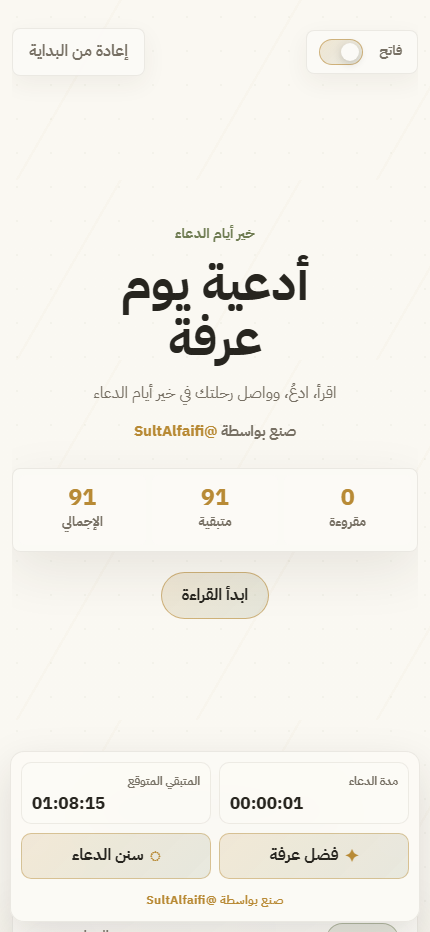
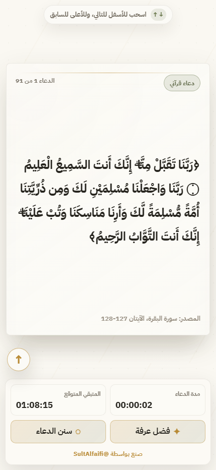
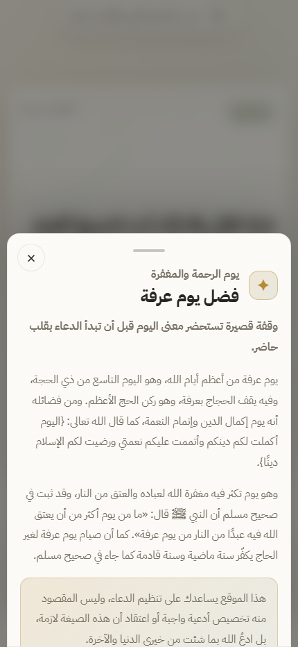
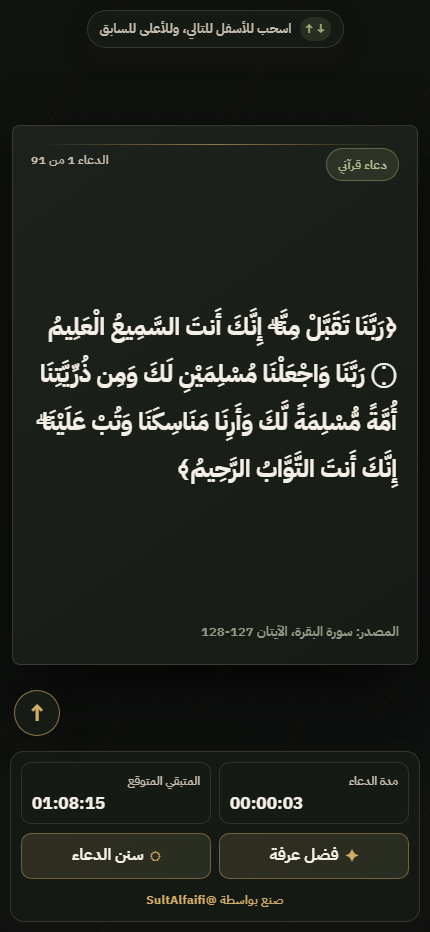

<div dir="rtl" align="right">

# أدعية يوم عرفة

موقع ويب ساكن، هادئ، وPhone First لقراءة أدعية يوم عرفة داخل بطاقات تفاعلية. التجربة مصممة لتكون أقرب إلى تطبيق قراءة روحاني: بطاقات متمركزة، تنقل بالسحب، حفظ تلقائي للتقدم، مؤقت للجلسة، ووضع ليلي أنيق.

لا يحتاج المشروع إلى Backend أو تسجيل دخول أو قاعدة بيانات أو API خارجي. يمكن رفعه مباشرة على GitHub Pages.

<p>
  
  
  
  
</p>

## لقطات من الموقع

<table>
  <tr>
    <td align="center">
      
      <br>
      <sub>واجهة البداية</sub>
    </td>
    <td align="center">
      
      <br>
      <sub>بطاقات القراءة</sub>
    </td>
  </tr>
  <tr>
    <td align="center">
      
      <br>
      <sub>نافذة فضل يوم عرفة</sub>
    </td>
    <td align="center">
      
      <br>
      <sub>الوضع الداكن</sub>
    </td>
  </tr>
</table>

## الفكرة

الموقع يساعد القارئ على تنظيم جلسة الدعاء في يوم عرفة عبر بطاقات مرتبة ومريحة للعين. كل دعاء يظهر في كرت مستقل مع شارة نوع الدعاء ومصدره عند الحاجة، مع عدادات للتقدم ووقت الدعاء والوقت المتوقع للمتبقي.

> الموقع ليس لتخصيص صيغة واجبة للدعاء، بل لتنظيم القراءة والدعاء بما ثبت أو بما هو عام صحيح المعنى.

## المميزات

- تصميم عربي كامل باتجاه RTL.
- واجهة Phone First مناسبة للجوال أولًا.
- بطاقات أدعية تفاعلية بتأثير Stack Cards.
- انتقال بطاقة ببطاقة بالسحب أو عجلة الماوس أو لوحة المفاتيح.
- حفظ التقدم تلقائيًا في LocalStorage.
- مؤقت جلسة الدعاء مع حفظ الوقت.
- تقدير تلقائي للوقت المتبقي بناءً على سرعة القراءة.
- وضع فاتح وداكن مع حفظ التفضيل.
- نوافذ منبثقة أنيقة لفضل يوم عرفة وسنن وآداب الدعاء.
- زر إعادة من البداية مع تأكيد داخل الموقع.
- دعم الوصول: تباين واضح، أزرار قابلة للنقر، إغلاق النوافذ بـ Escape، واحترام `prefers-reduced-motion`.
- يعمل كملفات Static فقط، بدون Backend.

## هيكل المشروع

```text
.
├── index.html
├── style.css
├── script.js
├── README.md
└── assets
    └── screenshots
        ├── hero-mobile.png
        ├── reader-mobile.png
        ├── virtue-modal-mobile.png
        └── dark-reader-mobile.png
```

## التشغيل محليًا

يمكن فتح الملف مباشرة:

```text
index.html
```

أو تشغيله بسيرفر محلي بسيط:

```bash
npx serve .
```

ثم افتح الرابط الذي يظهر في الطرفية، مثل:

```text
http://localhost:3000
```

## النشر على GitHub Pages

1. ارفع الملفات إلى مستودع GitHub.
2. افتح إعدادات المستودع: `Settings`.
3. اختر `Pages`.
4. من `Build and deployment` اختر:
   - Source: `Deploy from a branch`
   - Branch: `main`
   - Folder: `/root`
5. احفظ الإعدادات وانتظر رابط النشر.

## البيانات والحفظ

يحفظ الموقع بيانات الجلسة محليًا في متصفح المستخدم فقط:

```text
arafah_dua_progress
arafah_dua_read_count
arafah_dua_elapsed_time
arafah_dua_theme
```

لا يتم إرسال أي بيانات إلى خادم خارجي.

## التقنيات

- HTML5
- CSS3
- JavaScript Vanilla
- LocalStorage
- CSS Transforms and Transitions
- Responsive RTL Layout

## المحتوى الشرعي

تتضمن البطاقات أدعية قرآنية، أذكارًا جامعة، وأدعية نبوية مع عزو مختصر داخل البطاقة عند توفره. كما تتضمن النوافذ معلومات مختصرة عن فضل يوم عرفة وآداب الدعاء مع مراعاة عدم الجزم بما يحتاج إلى تحقق حديثي.

## الحقوق

صنع بواسطة [@SultAlfaifi](https://x.com/SultAlfaifi)

</div>
